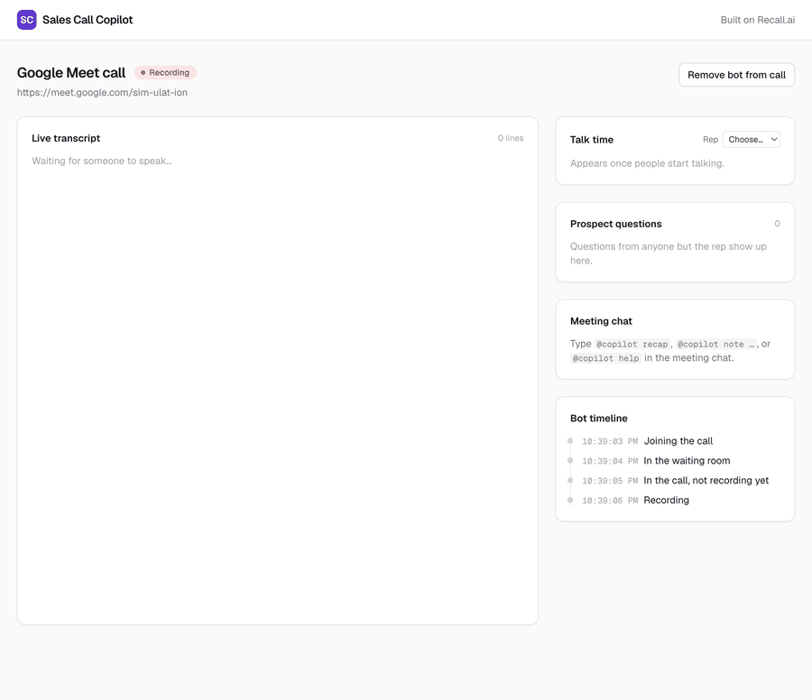
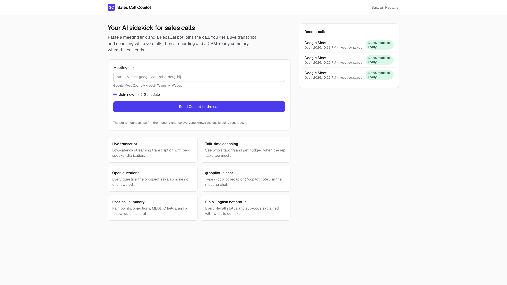
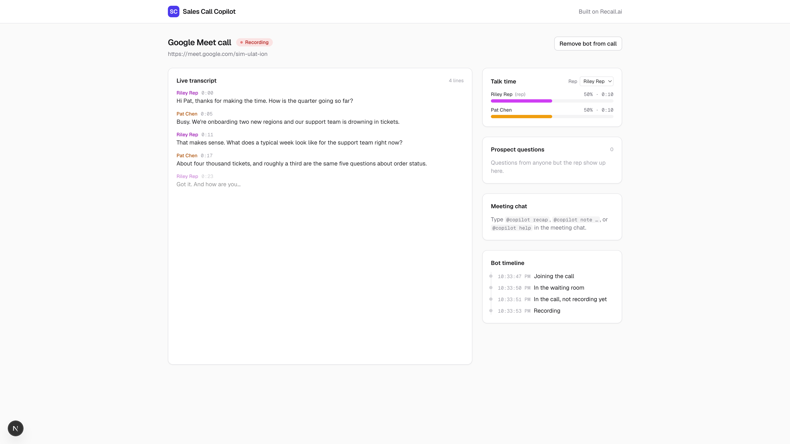
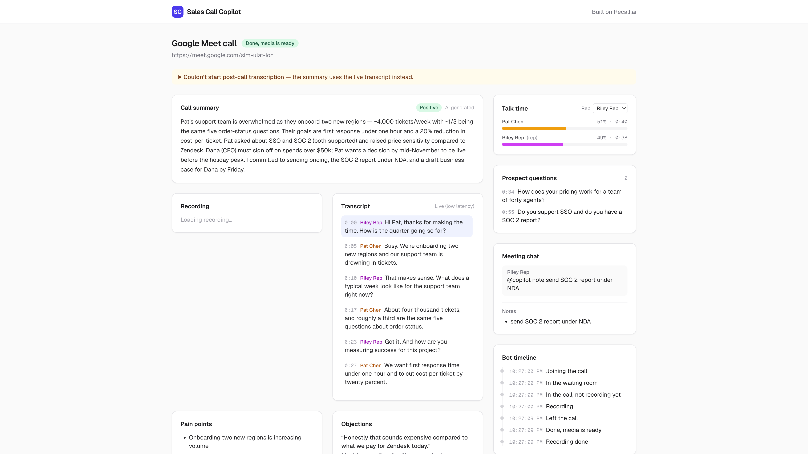
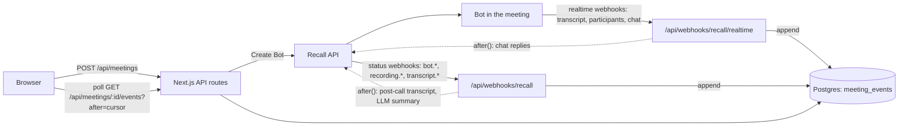

# Sales Call Copilot

A starter app for building revenue-intelligence features (call coaching, CRM auto-fill, follow-ups) on [Recall.ai](https://www.recall.ai). Paste a meeting link and a Recall bot joins the call. You get a live transcript and coaching while you talk, and a recording, an accurate transcript, and a CRM-ready summary when the call ends. Clone it, swap the prompts and the CRM sink, and ship.

[](https://vercel.com/new/clone?repository-url=https%3A%2F%2Fgithub.com%2Ftariktrokic%2Frecall-sales-copilot&project-name=recall-sales-copilot&env=RECALL_REGION,RECALL_API_KEY,RECALL_WEBHOOK_SECRET&envDescription=Recall%20region%2C%20API%20key%2C%20and%20workspace%20verification%20secret%20(whsec_...)&envLink=https%3A%2F%2Fgithub.com%2Ftariktrokic%2Frecall-sales-copilot%23environment-variables&products=%5B%7B%22type%22%3A%22integration%22%2C%22protocol%22%3A%22storage%22%2C%22productSlug%22%3A%22neon%22%2C%22integrationSlug%22%3A%22neon%22%7D%5D)

**Live demo:** https://recall-sales-copilot.vercel.app



## Who this is for

Sales and revenue intelligence is the biggest group of products built on Recall: tools like HubSpot, Mixmax, Gong-style coaching, and CRM auto-fill. Those teams use Recall so they don't have to build and run meeting bots themselves, but they still have to build everything on top of the bot: the webhook plumbing, the live UI, and the post-call pipeline. This repo is that layer, small enough to read in an afternoon, with the Recall-specific details (signature checks, retries, sub-codes, transcript trade-offs) already handled.

## Features and the Recall APIs behind them

| Feature | Recall API |
|---|---|
| Send a bot now, or schedule one | [Create Bot](https://docs.recall.ai/reference/bot_create) with `join_at` and an `Idempotency-Key` |
| Bot status in plain English, with what to do next | [Status webhooks](https://docs.recall.ai/docs/bot-status-change-events) and [sub-codes](https://docs.recall.ai/docs/sub-codes) |
| Live transcript, 1–3 seconds behind | `recallai_streaming` in `prioritize_low_latency` mode, [realtime webhooks](https://docs.recall.ai/docs/real-time-event-payloads) `transcript.data` and `transcript.partial_data` |
| Speaker names and talk time | Per-participant streams (`diarization.use_separate_streams_when_available`), word timestamps |
| Who joined and left | `participant_events.join` and `participant_events.leave` |
| `@copilot recap`, `@copilot note …`, `@copilot help` in the meeting chat | `participant_events.chat_message` in, [Send Chat Message](https://docs.recall.ai/reference/bot_send_chat_message_create) out |
| Recording consent message when the bot joins | `chat.on_bot_join` (pinned on Google Meet) |
| Accurate post-call transcript | [Create Async Transcript](https://docs.recall.ai/docs/async-transcription) (`recallai_async`) on `recording.done` |
| Video playback with click-to-seek transcript | [Retrieve Bot](https://docs.recall.ai/reference/bot_retrieve) `media_shortcuts.video_mixed` (fresh signed URL per view) |
| Summary, pain points, objections, MEDDIC fields, follow-up email | Your LLM of choice, fed the transcript above |

<details>
<summary>Screenshots</summary>





</details>

## Quickstart

You need a [Recall.ai account](https://www.recall.ai) and, from its dashboard (**Developers → API Keys**):

- an **API key**, and
- the **Workspace Verification Secret** (starts with `whsec_`), used to verify every webhook.

### Option A: deploy to Vercel (about 5 minutes)

1. Click **Deploy with Vercel** above. Vercel clones the repo, provisions a Neon Postgres database, and asks for `RECALL_REGION`, `RECALL_API_KEY`, and `RECALL_WEBHOOK_SECRET`. The build runs the database migrations.
2. In the Recall dashboard, go to **Webhooks → Add endpoint** and enter `https://<your-project>.vercel.app/api/webhooks/recall` (your **production** domain, no trailing slash). Subscribe to:
   `bot.joining_call`, `bot.in_waiting_room`, `bot.in_call_not_recording`, `bot.recording_permission_allowed`, `bot.recording_permission_denied`, `bot.in_call_recording`, `bot.call_ended`, `bot.done`, `bot.fatal`, `recording.done`, `recording.failed`, `transcript.done`, `transcript.failed`.
3. Open the app, paste a meeting link, and admit "Sales Copilot" when it knocks.

LLM summaries work out of the box on Vercel through the [AI Gateway](https://vercel.com/docs/ai-gateway). Without any LLM the app still runs and produces rule-based summaries.

### Option B: run locally

Recall has to reach your machine, so you need a tunnel. Recall also rejects any request whose body contains a `localhost` URL, so the tunnel's public URL is what the bot is configured with.

```bash
git clone https://github.com/tariktrokic/recall-sales-copilot && cd recall-sales-copilot
npm install
cp .env.example .env.local        # fill in the Recall values and DATABASE_URL (any Postgres)
ngrok http 3000 --url your-subdomain.ngrok-free.app   # then set PUBLIC_URL to that https URL
npm run db:migrate
npm run dev
```

Then add a second webhook endpoint in the Recall dashboard pointing at `https://your-subdomain.ngrok-free.app/api/webhooks/recall` with the same events as above. Each environment ignores webhooks for bots it didn't create, so production and local can share one Recall workspace.

### Try it without a meeting

```bash
npm run simulate                                   # against http://localhost:3000
npm run simulate -- https://<your-project>.vercel.app
```

[`scripts/simulate.ts`](scripts/simulate.ts) replays a scripted discovery call as signed webhooks through the real routes: status changes, partial and final transcript lines, a chat command, then `recording.done`. The bot is fake, so the post-call transcript request fails at Recall and the app falls back to the live transcript, which is also a good way to see that path working.

### Environment variables

| Variable | Required | Notes |
|---|---|---|
| `RECALL_REGION` | yes | `us-west-2`, `us-east-1`, `eu-central-1`, or `ap-northeast-1`. Must match the region your API key belongs to. |
| `RECALL_API_KEY` | yes | Dashboard → Developers → API Keys |
| `RECALL_WEBHOOK_SECRET` | yes | Workspace Verification Secret, `whsec_...` |
| `DATABASE_URL` | yes | Postgres. Set automatically by the Vercel Neon integration. |
| `PUBLIC_URL` | local only | Your tunnel URL. On Vercel it's derived from the production domain. |
| `AI_GATEWAY_API_KEY` / `OPENAI_API_KEY` | no | Locally, pick one for LLM summaries. On Vercel the gateway authenticates automatically. |
| `AI_MODEL` | no | Defaults to `openai/gpt-5-mini`. |

## How it works



**Everything is an event in one append-only table.** Each webhook handler verifies the signature, records the `webhook-id` so retries are ignored, writes one normalized row to `meeting_events`, and returns 200. Anything slow (replying in the chat, requesting the post-call transcript, calling the LLM) runs afterwards in Next.js [`after()`](https://nextjs.org/docs/app/api-reference/functions/after). Recall delivers realtime webhooks in order, so a slow handler would delay every transcript line behind it.

**The browser polls our database, not Recall.** The meeting page asks for events after the last id it has seen, about once a second while the call is live, and folds them into a view with the same pure functions the server uses ([`lib/copilot/view.ts`](lib/copilot/view.ts)). Polling suits serverless: webhooks and browsers land on different instances, so there's no shared memory to push from. Swapping in Pusher or Ably only touches `appendEvent()` and [`hooks/useMeetingEvents.ts`](hooks/useMeetingEvents.ts).

**Two transcripts: fast during the call, accurate after.** Live transcription uses `prioritize_low_latency` (1–3 seconds, English only). The default `prioritize_accuracy` mode can delay realtime events by minutes, which makes a live view look broken. When `recording.done` arrives, the app asks Recall for an async transcript of the recording, tagged with `metadata.kind = "post_call"` so its `transcript.done` webhook is recognizable. That transcript feeds the summary. If anything in that path fails, the summary is built from the live transcript instead, and the UI says so.

Sequence diagrams for the bot lifecycle, realtime path, and post-call path are in [docs/architecture.md](docs/architecture.md).

## Where to look in the code

| File | What's in it |
|---|---|
| [`lib/recall/botConfig.ts`](lib/recall/botConfig.ts) | **Start here.** Everything about how the bot behaves: name, consent message, transcription mode, timeouts, retention. |
| [`lib/constants/`](lib/constants) | One file per vocabulary: `recall.ts` (Recall's status codes, event names, and meeting platforms, how events map to ours, and what the bot subscribes to), `events.ts` (our own event types and the closed sets in their payloads), `status.ts` (our own statuses and the lifecycle groups), `urls.ts` (every API path). |
| [`lib/recall/client.ts`](lib/recall/client.ts) | Typed Recall client. Retries 429 (with `Retry-After`), 507 (bot pool busy), and 5xx; idempotency keys; helpful error hints. |
| [`lib/recall/verify.ts`](lib/recall/verify.ts) | Webhook signature verification with timestamp tolerance and constant-time comparison. |
| [`lib/recall/events.ts`](lib/recall/events.ts), [`subCodes.ts`](lib/recall/subCodes.ts) | zod schemas for webhook payloads; status and sub-code explanations. |
| [`lib/webhooks/receiver.ts`](lib/webhooks/receiver.ts) | The shared webhook pipeline: verify, dedupe, store, respond, then `after()`. |
| [`lib/db/repository.ts`](lib/db/repository.ts) | Every database query, next to the connection and schema in `lib/db/`. |
| [`lib/meetings/ingestService.ts`](lib/meetings/ingestService.ts) | What each webhook means: Recall payloads become our events, plus any slow follow-up work. |
| [`lib/meetings/meetingService.ts`](lib/meetings/meetingService.ts) | Dashboard actions: create a meeting (send a bot), remove the bot, get the recording. |
| [`lib/meetings/postCallService.ts`](lib/meetings/postCallService.ts), [`chatService.ts`](lib/meetings/chatService.ts) | Post-call transcript and summary (with fallback); `@copilot` replies (with a database-backed rate limit). |
| [`lib/copilot/`](lib/copilot) | Pure functions shared by server and browser: talk time, question detection, chat command parsing, the event-to-view reducer, LLM prompts and the insights schema. |
| [`hooks/useMeetingEvents.ts`](hooks/useMeetingEvents.ts) | The polling hook, with adaptive intervals. |
| [`tests/`](tests) | Unit tests for all of the above, using webhook fixtures in `tests/fixtures/`. |

## Extending this

- **Push to your CRM.** `summarize()` in [`lib/meetings/postCallService.ts`](lib/meetings/postCallService.ts) has the validated `SalesInsights` object in hand. Add a HubSpot or Salesforce call next to `saveInsights()`.
- **Change the methodology.** The insights schema and prompts are in [`lib/copilot/insightsSchema.ts`](lib/copilot/insightsSchema.ts) and [`insights.ts`](lib/copilot/insights.ts). Swap MEDDIC for BANT or SPICED by editing the schema; the UI renders whatever fields it has.
- **Join calls automatically.** Recall's [Calendar integration](https://docs.recall.ai/docs/calendar-integration) can schedule bots from reps' calendars. It needs Google or Microsoft OAuth, which is why this demo uses a pasted link.
- **Let the bot speak.** [Output Media](https://docs.recall.ai/docs/stream-media) lets a bot play audio or show a webpage, the basis for a voice agent that answers questions mid-call.
- **Record without a bot.** The [Desktop Recording SDK](https://docs.recall.ai/docs/desktop-sdk) captures calls from the rep's computer. Its events can go into the same `meeting_events` log.
- **Add commands.** Chat commands are parsed in [`lib/copilot/commands.ts`](lib/copilot/commands.ts) and answered in [`lib/meetings/chatService.ts`](lib/meetings/chatService.ts). `@copilot ask <question>` is a natural next one.

## Production checklist

This is a demo. Before real customers use it:

- **Authentication and tenancy.** There's no login: anyone with the URL can send a bot on your Recall account. Add auth, scope meetings to users or orgs, and check ownership in every route.
- **A durable queue instead of `after()`.** `after()` runs once, with no retry if the function dies. Use Vercel Queues, Inngest, or SQS for the post-call pipeline and chat replies.
- **Push instead of polling.** Each open meeting tab makes about one indexed query per second while live (fewer when hidden or after the call). That's fine for a demo; at scale, publish events through Pusher, Ably, or Supabase Realtime.
- **Consent and retention.** The bot announces itself, but check the recording-consent rules where your users are. Media is kept for 7 days (`retention` in `botConfig.ts`); align that with your policy and delete data on request.
- **Prune the event log.** Partial transcript events are only useful while the call is live. Delete them after `done`.
- **Observability.** Log webhook latency and failures, and alert on `bot.fatal` and on `pipeline.error` events.

## Troubleshooting

| Symptom | Cause and fix |
|---|---|
| Webhooks return 401 | Wrong secret: use the **Workspace Verification Secret**, not a per-endpoint one. Or the deployment is a Vercel *preview*, which has Deployment Protection; point Recall at the production domain. |
| Creating a bot fails with 401 | `RECALL_REGION` doesn't match the region the API key was created in. |
| Creating a bot fails with 403 `request_blocked` | The bot config contains a `localhost` URL. Set `PUBLIC_URL` to your tunnel. |
| Bot sits "In the waiting room" | Someone has to admit it. It leaves after 10 minutes (`automatic_leave.waiting_room_timeout`). |
| Live transcript is empty | Realtime events only arrive once the status is **Recording**. On Zoom the host may need to allow recording. If you changed the transcription mode to `prioritize_accuracy`, events arrive minutes late. |
| Webhook URL redirects (308) | Remove the trailing slash. Next.js redirects `/path/` to `/path`. |
| Bot doesn't reply to `@copilot` | Replies are limited to one every 5 seconds per meeting. Messages from the bot itself are ignored. |
| Summary says "Rule-based" | No LLM is configured. On Vercel the AI Gateway is automatic; locally set `AI_GATEWAY_API_KEY` or `OPENAI_API_KEY`. |
| `.env.example` missing after `vercel link` | The Vercel CLI appends `.env*` to `.gitignore`. Keep the `!.env.example` line after it. |

## Known limitations

- Live transcription is English-only (`prioritize_low_latency`). The post-call transcript auto-detects the language.
- Talk time is based on transcribed speech, so silence and crosstalk aren't counted.
- Question detection is a heuristic (a question mark, or a sentence starting with a question word).
- The rep defaults to the meeting host. If the host isn't the seller, pick the rep in the Talk time panel.
- Pinned consent messages work on Google Meet only. Google Meet also caps chat messages at 500 characters, so recaps are kept short.

## Working on this repo with an AI agent

[`AGENTS.md`](AGENTS.md) has the conventions. For Recall-specific questions, connect the [Recall MCP server](https://docs.recall.ai/docs/mcp): copy [`.cursor/mcp.example.json`](.cursor/mcp.example.json) to `.cursor/mcp.json` (gitignored) and add your MCP key. Agents can then inspect bots, logs, and webhook deliveries in your workspace instead of guessing.

## Scripts

```bash
npm run dev          # Next.js dev server
npm test             # unit tests (Vitest)
npm run typecheck    # route types + tsc
npm run lint
npm run db:generate  # new migration after editing lib/db/schema.ts
npm run db:migrate
npm run simulate     # replay a scripted call as signed webhooks
```
