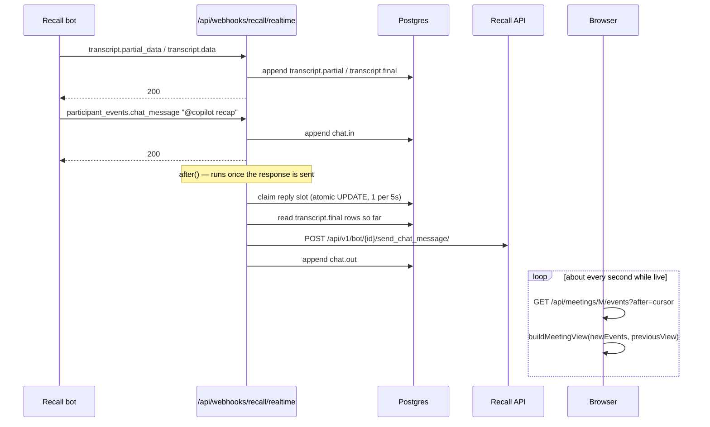
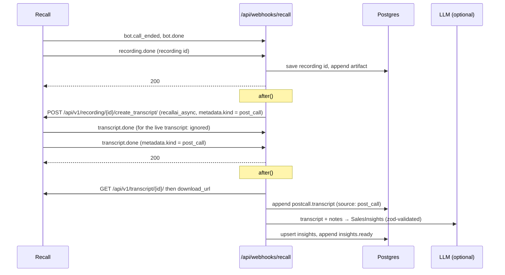

# Architecture

The app is a Next.js project with three moving parts: API routes the browser calls, two webhook routes Recall calls, and one Postgres table (`meeting_events`) that connects them. This page walks through the three flows in a call's life.

## Data model

| Table | Purpose |
|---|---|
| `meetings` | One row per bot: meeting URL, platform, Recall `bot_id`, latest status and sub-code, the chosen rep, the post-call `recording_id` and `async_transcript_id`, and `last_bot_reply_at` (the chat rate limit). |
| `meeting_events` | Append-only log of everything that happened in a meeting. `id` is a `bigserial`, used as the polling cursor. The UI is built entirely from these rows. |
| `insights` | The latest validated `SalesInsights` per meeting, ready to sync to a CRM. |
| `processed_webhooks` | `webhook-id`s already handled. Recall (via Svix) retries deliveries, so each one is stored once. |

Event types are defined in [`lib/copilot/types.ts`](../lib/copilot/types.ts): `status`, `artifact`, `transcript.partial`, `transcript.final`, `participant.join`, `participant.leave`, `chat.in`, `chat.out`, `note`, `postcall.transcript`, `insights.ready`, `pipeline.error`.

## 1. Creating a bot and following its status

```mermaid
sequenceDiagram
  participant B as Browser
  participant A as POST /api/meetings
  participant R as Recall API
  participant W as /api/webhooks/recall
  participant DB as Postgres

  B->>A: meetingUrl, joinAt?
  A->>DB: insert meeting (id = M)
  A->>R: POST /api/v1/bot/ (metadata.app_meeting_id = M, Idempotency-Key: M)
  Note over A,R: 507 (pool busy) waits 30s and retries; 429 honors Retry-After
  R-->>A: bot id
  A->>DB: save bot id, append status "created" or "scheduled"
  A-->>B: 201 { meeting }
  loop bot.joining_call, bot.in_waiting_room, bot.in_call_recording, ...
    R->>W: signed status webhook
    W->>W: verify signature and timestamp
    W->>DB: insert webhook-id (skip if seen)
    W->>DB: update meetings.status_code, append "status"
    W-->>R: 200
  end
```

- The meeting id goes into bot `metadata`, so every webhook can be routed back to the right row without a lookup table. Bots created by another environment (for example local development sharing the same Recall workspace) have ids this database doesn't know, and are ignored.
- Status webhooks can arrive out of order. A finished meeting (`done`, `fatal`) is never moved back to a live status.
- `code` and `sub_code` are stored as plain strings. [`lib/recall/subCodes.ts`](../lib/recall/subCodes.ts) explains the known ones and shows unknown ones as-is.

## 2. During the call: realtime events



- Writing the row before responding means the log order matches the order the events arrived in. Everything slow runs in `after()`: Recall retries a realtime webhook every second until it gets a 2xx and marks the endpoint failed after 60 attempts, so the response can't wait on an LLM call.
- Recall has no "transcript so far" endpoint, so `@copilot recap` is built from the `transcript.final` rows already stored.
- The rate limit is an atomic `UPDATE ... WHERE last_bot_reply_at < now() - 5s RETURNING`. An in-memory counter wouldn't work because each webhook may run in a different function instance.
- Talk time, prospect questions, and the transcript are computed in the browser by the pure functions in [`lib/copilot/`](../lib/copilot), the same ones the server uses for recaps and summaries.

## 3. After the call: accurate transcript and summary



- Both the live and the post-call transcript send `transcript.done`. The one this app requested carries `metadata.kind = "post_call"`, which is how the handler tells them apart.
- If requesting or processing the post-call transcript fails, or `recording.failed` arrives, the summary is built from the stored live transcript and a `pipeline.error` event explains why. The UI shows it as a warning, not a failure.
- Without an LLM, [`ruleBasedInsights()`](../lib/copilot/insights.ts) produces a summary from talk time, questions, and notes, so the page is never empty.
- The video URL is fetched from Retrieve Bot every time the page asks for it, because Recall's signed download URLs expire.
